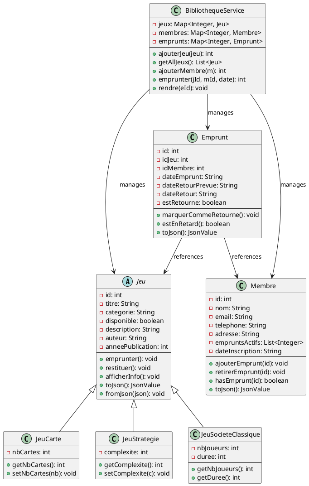

```
╔════════════════════════════════════════════════════════════════════════════════╗
║                  BOARD GAME LIBRARY - UML CLASS DIAGRAM                        ║
║                            (PlantUML Format)                                   ║
╚════════════════════════════════════════════════════════════════════════════════╝

┌─────────────────────────────────────────────────────────────────────────────────┐
│                                 <<Abstract>>                                    │
│                                   << Jeu >>                                     │
├─────────────────────────────────────────────────────────────────────────────────┤
│ Attributes:                                                                      │
│   - id: int                                                                      │
│   - titre: string                                                                │
│   - categorie: string                                                            │
│   - disponible: bool                                                             │
│   - description: string                                                          │
│   - auteur: string                                                               │
│   - anneePublication: int                                                        │
├─────────────────────────────────────────────────────────────────────────────────┤
│ Methods:                                                                         │
│   + getId(): int                                                                 │
│   + getTitre(): string                                                           │
│   + estDisponible(): bool                                                        │
│   + emprunter(): void                                                            │
│   + restituer(): void                                                            │
│   + afficherInfo(): void                                                         │
│   + toJson(): Json::Value                                                        │
│   + fromJson(json: Json::Value): void                                            │
│   + getType(): string {virtual}                                                  │
└─────────────────────────────────────────────────────────────────────────────────┘
         ▲                    ▲                    ▲
         │ inherits           │ inherits           │ inherits
         │                    │                    │
    ┌────┴──────────┐     ┌──┴────────────┐   ┌──┴──────────────┐
    │   JeuCarte    │     │ JeuStrategie  │   │JeuSocieteClass. │
    ├───────────────┤     ├───────────────┤   ├─────────────────┤
    │- nbCartes: int│     │-complexite:int│   │-nbJoueurs: int  │
    │  (1-10)       │     │               │   │-duree: int (min)│
    ├───────────────┤     ├───────────────┤   ├─────────────────┤
    │+ getNbCartes()│     │+ getComplexite│   │+ getNbJoueurs() │
    │+ setNbCartes()│     │+ setComplexite│   │+ getDuree()     │
    └───────────────┘     └───────────────┘   └─────────────────┘


┌─────────────────────────────────────────────────────────────────────────────────┐
│                                 << Membre >>                                    │
├─────────────────────────────────────────────────────────────────────────────────┤
│ Attributes:                                                                      │
│   - id: int                                                                      │
│   - nom: string                                                                  │
│   - email: string                                                                │
│   - telephone: string                                                            │
│   - adresse: string                                                              │
│   - empruntsActifs: vector<int>                                                  │
│   - dateInscription: string                                                      │
├─────────────────────────────────────────────────────────────────────────────────┤
│ Methods:                                                                         │
│   + getId(): int                                                                 │
│   + getNom(): string                                                             │
│   + getEmail(): string                                                           │
│   + getTelephone(): string                                                       │
│   + getAdresse(): string                                                         │
│   + getEmpruntsActifs(): vector<int>                                             │
│   + ajouterEmprunt(idJeu: int): void                                             │
│   + retirerEmprunt(idJeu: int): void                                             │
│   + hasEmprunt(idJeu: int): bool                                                 │
│   + getNombreEmpruntsActifs(): int                                               │
│   + afficherInfo(): void                                                         │
│   + toJson(): Json::Value                                                        │
│   + fromJson(json: Json::Value): void                                            │
└─────────────────────────────────────────────────────────────────────────────────┘


┌─────────────────────────────────────────────────────────────────────────────────┐
│                                << Emprunt >>                                    │
├─────────────────────────────────────────────────────────────────────────────────┤
│ Attributes:                                                                      │
│   - id: int                                                                      │
│   - idJeu: int                                                                   │
│   - idMembre: int                                                                │
│   - dateEmprunt: string (YYYY-MM-DD)                                             │
│   - dateRetourPrevue: string (YYYY-MM-DD)                                        │
│   - dateRetour: string (YYYY-MM-DD, nullable)                                    │
│   - estRetourne: bool                                                            │
├─────────────────────────────────────────────────────────────────────────────────┤
│ Methods:                                                                         │
│   + getId(): int                                                                 │
│   + getIdJeu(): int                                                              │
│   + getIdMembre(): int                                                           │
│   + getDateEmprunt(): string                                                     │
│   + getDateRetour(): string                                                      │
│   + getDateRetourPrevue(): string                                                │
│   + estRetourne_(): bool                                                         │
│   + marquerCommeRetourne(): void                                                 │
│   + estEnRetard(): bool                                                          │
│   + afficherInfo(): void                                                         │
│   + toJson(): Json::Value                                                        │
│   + fromJson(json: Json::Value): void                                            │
└─────────────────────────────────────────────────────────────────────────────────┘
         △              △
         │ "references" │ "references"
         │              │
         └──────┬───────┘
                │
    ┌───────────┴──────────────┐
    │                          │
    │  uses 0..*          has 0..*
    │                          │
    ▼                          ▼
 Jeu (1)                   Membre (1)


┌─────────────────────────────────────────────────────────────────────────────────┐
│                          << BibliothequeService >>                              │
│                            (Service/Repository)                                 │
├─────────────────────────────────────────────────────────────────────────────────┤
│ Attributes:                                                                      │
│   - jeux: map<int, unique_ptr<Jeu>>                                              │
│   - membres: map<int, Membre>                                                    │
│   - emprunts: map<int, Emprunt>                                                  │
│   - nextJeuId: int                                                               │
│   - nextMembreId: int                                                            │
│   - nextEmpruntId: int                                                           │
├─────────────────────────────────────────────────────────────────────────────────┤
│ Game Operations:                                                                 │
│   + ajouterJeu(jeu: unique_ptr<Jeu>): int                                        │
│   + getAllJeux(): vector<Jeu*>                                                   │
│   + getAllJeuxConst(): vector<const Jeu*>                                        │
│   + getJeu(id: int): Jeu*                                                        │
│   + updateJeu(id: int, jeu: unique_ptr<Jeu>): void                               │
│   + deleteJeu(id: int): void                                                     │
│   + getJeuxDisponibles(): vector<Jeu*>                                           │
├─────────────────────────────────────────────────────────────────────────────────┤
│ Member Operations:                                                               │
│   + ajouterMembre(membre: const Membre&): int                                    │
│   + getAllMembres(): vector<Membre*>                                             │
│   + getMembre(id: int): Membre*                                                  │
│   + updateMembre(id: int, membre: const Membre&): void                           │
│   + deleteMembre(id: int): void                                                  │
├─────────────────────────────────────────────────────────────────────────────────┤
│ Borrow Operations:                                                               │
│   + emprunter(idJeu: int, idMembre: int, dateRetour: string): int                │
│   + rendre(idEmprunt: int): void                                                 │
│   + getAllEmprunts(): vector<Emprunt*>                                           │
│   + getEmpruntsActifs(idMembre: int): vector<Emprunt*>                           │
│   + getEmprunt(id: int): Emprunt*                                                │
│   + getEmpruntsEnRetard(): vector<Emprunt*>                                      │
└─────────────────────────────────────────────────────────────────────────────────┘
         △
         │ uses (Singleton Pattern)
         │ dependency injection
         │
    ┌────┴────────────────────────┐
    │                             │
    ▼                             ▼
 JeuxController          EmpruntsController
 MembresController       (REST Controllers)


╔════════════════════════════════════════════════════════════════════════════════╗
║                            RELATIONSHIPS                                        ║
╚════════════════════════════════════════════════════════════════════════════════╝

Jeu ◄──────────────────► Emprunt ◄──────────────────► Membre
    (1)           (0..*)        (0..*)           (1)
  
  Cardinality:
  - One Game can have MANY Borrow records (when returned and borrowed again)
  - One Member can have MANY active/past Borrow records
  - One Borrow links ONE Game to ONE Member at a specific time


╔════════════════════════════════════════════════════════════════════════════════╗
║                        DATABASE SCHEMA MAPPING                                 ║
╚════════════════════════════════════════════════════════════════════════════════╝

Jeu Class              ──────────►  jeux Table
- id                              - id (PK)
- titre                           - titre
- categorie                       - categorie
- disponible                      - disponible
- description                     - description
- auteur                          - auteur
- anneePublication                - anneePublication
- nbCartes (JeuCarte)             - nbCartes
- complexite (JeuStrategie)       - complexite
- nbJoueurs (JeuSociete)          - nbJoueurs
- duree (JeuSociete)              - duree
- type (discriminator)            - type

Membre Class          ──────────►  membres Table
- id                              - id (PK)
- nom                             - nom
- email                           - email
- telephone                       - telephone
- adresse                         - adresse
- dateInscription                 - dateInscription
- empruntsActifs (derived)        - (computed from emprunts)

Emprunt Class         ──────────►  emprunts Table
- id                              - id (PK)
- idJeu                           - idJeu (FK -> jeux)
- idMembre                        - idMembre (FK -> membres)
- dateEmprunt                     - dateEmprunt
- dateRetourPrevue                - dateRetourPrevue
- dateRetour                      - dateRetour
- estRetourne                     - estRetourne


╔════════════════════════════════════════════════════════════════════════════════╗
║                        DESIGN PATTERNS USED                                    ║
╚════════════════════════════════════════════════════════════════════════════════╝

1. STRATEGY PATTERN
   - Different Jeu subclasses represent different game strategies
   - Polymorphic behavior through virtual methods

2. REPOSITORY PATTERN
   - BibliothequeService acts as a repository
   - Centralizes data access and persistence logic

3. SINGLETON PATTERN
   - BibliothequeService used as a singleton in controllers
   - Ensures single instance of service

4. JSON SERIALIZATION PATTERN
   - toJson() / fromJson() methods for API communication
   - Enables clean transformation between objects and HTTP

5. DEPENDENCY INJECTION
   - Controllers receive BibliothequeService
   - Loose coupling between components

6. INHERITANCE HIERARCHY
   - Clear parent-child relationships
   - Liskov Substitution Principle applied


╔════════════════════════════════════════════════════════════════════════════════╗
║                        INTERACTIONS DIAGRAM                                    ║
╚════════════════════════════════════════════════════════════════════════════════╝

Frontend (React)
      │
      │ HTTP Requests
      ▼
┌──────────────────┐
│   Controllers    │  (REST Endpoints)
│ ├─ JeuxCtr.      │
│ ├─ MembresCtr.   │
│ └─ EmpruntsCtr.  │
└──────────┬───────┘
           │
           │ Delegate business logic
           ▼
┌──────────────────────────────┐
│  BibliothequeService         │
│  (Business Logic & Data Mgmt)│
└──────────┬───────────────────┘
           │
           │ Manage objects
      ┌────┼────┬────────┐
      ▼    ▼    ▼        ▼
    Jeu Membre Emprunt Database
   (In-Memory Storage)

Future: Replace in-memory with actual database queries


╔════════════════════════════════════════════════════════════════════════════════╗
║                        STATE MACHINE                                           ║
╚════════════════════════════════════════════════════════════════════════════════╝

Game States:
┌─────────────┐
│  AVAILABLE  │ ──── member borrows game ────► BORROWED ──┐
└─────────────┘                                            │
       ▲                                                   │
       │                                                   │
       └─────── member returns game ◄─────────────────────┘

Borrow States:
┌──────────┐
│  ACTIVE  │ ──── due date reached ────► OVERDUE ──┐
└──────────┘                                       │
     ▲                                             │
     │                                             │
     └─── member returns game ◄──── COMPLETED ◄───┘


```

---

## PlantUML Version

Save this to `uml.puml` for use with PlantUML:



Compile with: `plantuml uml.puml` or use online editor at https://www.plantuml.com/plantuml/uml/

---

**UML Generated**: January 2025
**Version**: 1.0.0
